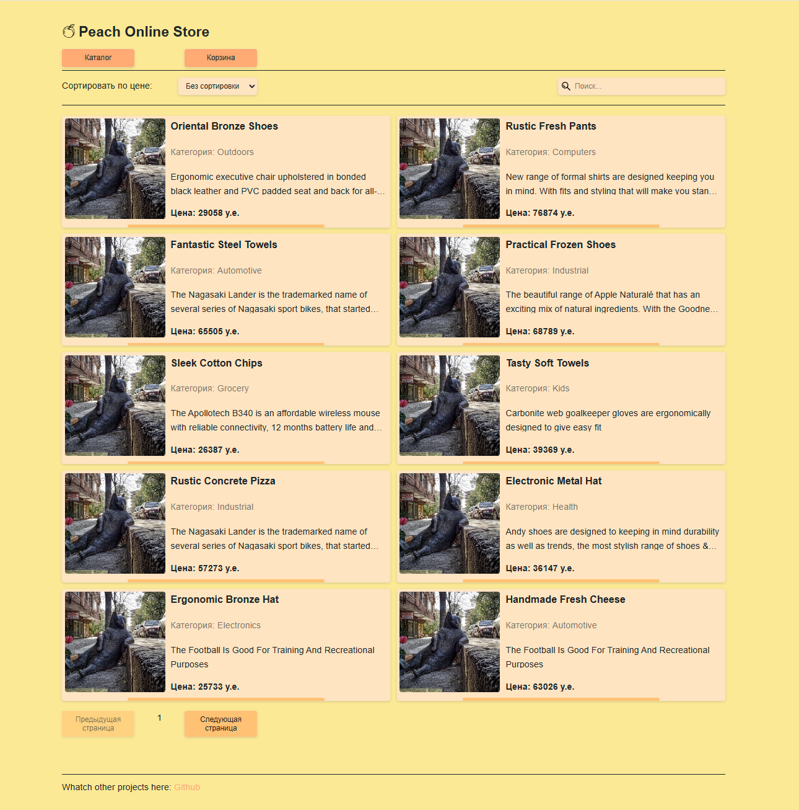
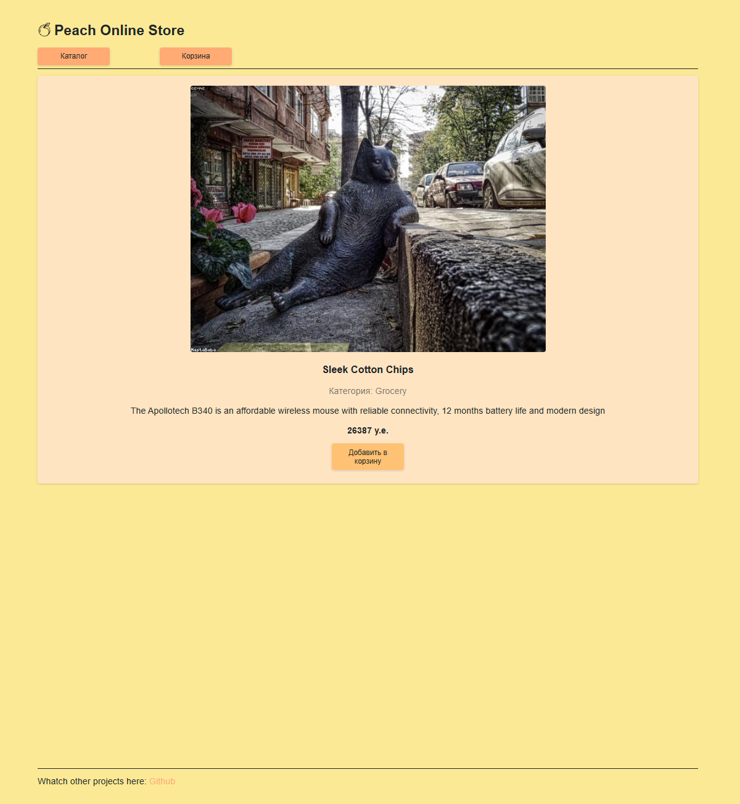
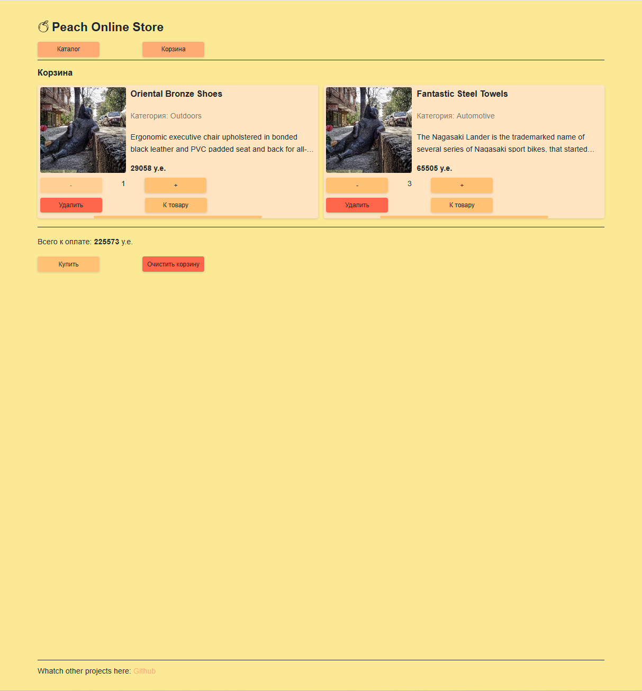
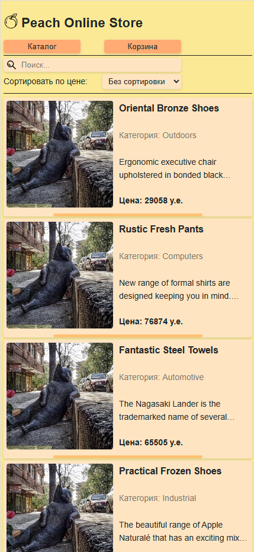

# Online Store

---

SPA приложение онлайн-магазина, реализованное на принципах **Feature-Based Architecture** с использованием **React, TypeScript, Redux Toolkit (RTK Query), SCSS Modules**. Проект адаптирован под все типы экранов, оптимизирован для масштабирования.
[Демо](https://archibaldkronin.github.io/online-store/)

---

## Демо

---

## Функциональность

- **Поиск** по товарам с debounce
- **Сортировка** товаров
- **Пагинация** с переключением страниц
- **Корзина товаров** с управлением количеством и удалением
- **Фильтрация URL-параметрами** (q, sort, page)
- **Адаптивный дизайн** (mobile-first, под 768px и 1024px)

---

## Стек технологий

- **React 18** + **React Router 6**
- **TypeScript**
- **Redux Toolkit** + **RTK Query**
- **SCSS Modules** + **@use, переменные, миксины**
- **Vite** — сборка проекта
- **ESLint** — анализ кода

---

## Архитектура

- **Feature-Based Architecture**
  - `/features/products` — каталог, карточка товара
  - `/features/cart` — корзина товаров
- **Переиспользуемые компоненты** — в `/components`
- **Хуки и функции** — изолированы в `/hooks` и `/functions`
- **Стили**:
  - глобальные (`_reset.scss`, `_variables.scss`, `_mixins.scss`, `_typography.scss`, `global.scss`)
  - модульные (`*.module.scss` для каждого компонента)
- **Типы данных** — в `/types`

---

## Адаптив и стилизация

- **Mobile-first подход**
- **Медиазапросы** через миксин `@include media(tablet|desktop)`
- Использование `rem` для масштабируемых размеров
- **Гибкая типографика**
- Миксины для `ellipsis`, `flex-center`, `border-radius`

---

## API

Проект использует **MockAPI** (https://mockapi.io/) в качестве имитации серверной части.
Все данные (товары, корзина) получаются через HTTP-запросы к публичному REST API, созданному на платформе mockAPI.io.
Работа с данными реализована через RTK Query.

---

## Преимущества

- Чистая и читаемая архитектура
- Модульность и масштабируемость
- Настроенный ESLint, SCSS, переменные, миксины
- Доступность (ARIA, фокус, клавиатура)
- Реализация всего базового функционала e-commerce SPA

---

## Возможности для улучшения

- Добавление UI-библиотеки (например, Radix)
- Настройка темной темы
- Тестирование компонентов (React Testing Library / Vitest)

---

## Скриншоты

### Каталог товаров



### Страница товара



### Корзина



### Мобильная версия



---

## Запуск проекта

```bash
npm install
npm run dev
```

---

## Автор

**Иван Логинов** — Frontend-разработчик, специализация: React + TypeScript + SCSS. Этот проект — выпускная работа в рамках самостоятельного курса.

---

## Ссылки

- [GitHub репозиторий](https://github.com/ArchibaldKronin/online-store)
- [Профиль на GitHub](https://github.com/ArchibaldKronin)

---

## Демо

[Посмотреть демо](https://archibaldkronin.github.io/online-store/)

---

> _Проект призван продемонстрировать владение современными инструментами фронтенд-разработки, архитектурным мышлением, адаптивной версткой и технической аккуратностью._
